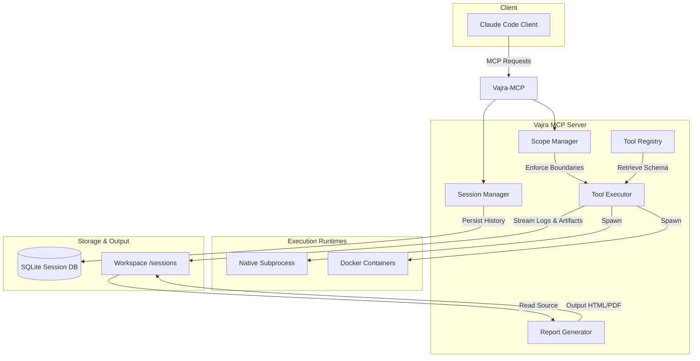
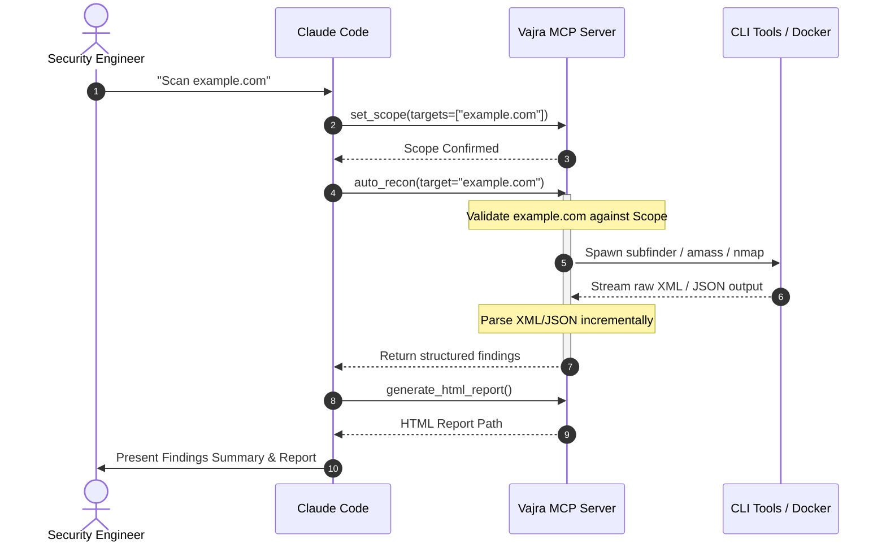

# Vajra MCP

Vajra MCP is a Model Context Protocol (MCP) server that connects Claude Code and other MCP-compatible clients to security tools through a structured execution layer.

Vajra MCP executes command-line security scanners, validates scanning targets against scope boundaries, monitors resource limits, recovers partial results during timeouts or crashes, and returns structured JSON payloads to the client.

---

## Features

* **MCP-Native Architecture**: Integrates with the Model Context Protocol, exposing security tools and workflows to MCP clients.
* **Claude Code Integration**: Acts as a local execution engine for Claude Code during security testing workflows.
* **Structured JSON Outputs**: Parses stdout/stderr lines from CLI security tools into normalized JSON schemas.
* **Scope Enforcement**: Enforces target validation (IPs, CIDRs, domains) before tool execution.
* **Session Persistence**: Saves execution details, scan history, raw logs, and findings in a local SQLite database.
* **HTML Reporting**: Generates interactive HTML reports detailing CVSS distribution, vulnerability cards, and activity timelines.
* **Artifact Storage**: Isolates raw outputs, screenshots, and logs in per-session folders.
* **Docker Execution Backend**: Supports running compatible tools inside isolated Docker containers, translating local paths to mount volumes.
* **Recovery & Partial Result Parsing**: Uses async chunked file streams to recover results generated prior to timeouts, crashes, or limit terminations.
* **Tool Health Diagnostics**: Diagnostic interface (`doctor` command) checking path status, versions, and missing API keys.
* **Resource Limits**: Restricts memory usage (RSS checks via `psutil`) and log sizes to prevent system resource exhaustion.

---

## Architecture



---

## Supported Tools

| Category | Tool | Docker Image | Status | Fallback Behavior |
| :--- | :--- | :--- | :--- | :--- |
| **Recon** | `nmap` | `instrumentisto/nmap:latest` | ✅ Supported | Native |
| **Recon** | `httpx` | `projectdiscovery/httpx:latest` | ✅ Supported | Native |
| **Recon** | `katana` | `projectdiscovery/katana:latest` | ✅ Supported | Native |
| **Recon** | `subfinder` | `projectdiscovery/subfinder:latest` | ✅ Supported | Native |
| **Recon** | `amass` | `caffix/amass:latest` | ✅ Supported | Native |
| **Recon** | `assetfinder` | `sle118/assetfinder:latest` | ✅ Supported | Native |
| **Recon** | `whatweb` | `securesocket/whatweb:latest` | ✅ Supported | Native |
| **Recon** | `wafw00f` | `securesocket/wafw00f:latest` | ✅ Supported | Native |
| **Web** | `nuclei` | `projectdiscovery/nuclei:latest` | ✅ Supported | Native |
| **Web** | `ffuf` | `ffuf/ffuf:latest` | ✅ Supported | Native |
| **Web** | `feroxbuster`| `epi052/feroxbuster:latest` | ✅ Supported | Native |
| **Web** | `dalfox` | `hahwul/dalfox:latest` | ✅ Supported | Native |
| **Web** | `sqlmap` | `paolonaldi/sqlmap:latest` | ✅ Supported | Native |
| **Web** | `wpscan` | `wpscan/wpscan:latest` | ✅ Supported | Native |
| **Web** | `testssl` | `drwetter/testssl.sh:latest` | ✅ Supported | Native |

---

## Installation

### Development Installation
Vajra MCP is not published on PyPI. Clone the repository and install in editable mode:
```bash
git clone https://github.com/AIwolfie/Vajra-MCP.git
cd Vajra-MCP
pip install -e .
```

### Optional PDF Report Support
To enable PDF report generation (requires Cairo, Pango, and GObject libraries installed on your host system):
```bash
pip install -e ".[pdf]"
```

---

## Claude Code Integration

Vajra MCP integrates with Claude Code. Example prompts for the client:

### 1. Run Reconnaissance
> "Set the scope to example.com and run auto_recon. Enumerate subdomains, filter active hosts, scan ports, and generate an HTML report."

### 2. Run Web Audit
> "Run a web audit on https://example.com. Check for XSS, SQL injections, and TLS weaknesses using a local wordlist."

### 3. Generate Report
> "Generate a vulnerability report for my current session and compile it to HTML."

### 4. Resume Session
> "List all previous scanning sessions, then resume session 1be07753."

---

## MCP Tool Reference

Vajra MCP exposes the following tools:

### `set_scope`
Defines the target boundary for the active assessment.
* **Payload**:
  ```json
  {
    "targets": ["10.0.0.0/24", "*.example.com"],
    "excludes": ["restricted.example.com"],
    "notes": "External penetration test scope"
  }
  ```

### `list_tools`
Lists supported tools and their installation status.
* **Payload**:
  ```json
  {
    "available_only": false
  }
  ```

### `run_tool`
Executes a single security tool within scope.
* **Payload**:
  ```json
  {
    "tool_name": "nmap",
    "args": {
      "target": "example.com",
      "ports": "80,443",
      "scan_type": "connect"
    },
    "timeout": 300
  }
  ```

### `auto_recon`
Automates subdomain profiling and service discovery.
* **Payload**:
  ```json
  {
    "target": "example.com",
    "depth": "standard",
    "timeout": 600,
    "max_hosts": 50
  }
  ```

### `web_audit`
Automates vulnerability fuzzing and web scanning.
* **Payload**:
  ```json
  {
    "target": "https://example.com",
    "checks": ["vuln", "sqli", "xss"],
    "wordlist": "wordlists/common.txt"
  }
  ```

### `generate_html_report`
Generates a consolidated HTML report from the database.
* **Payload**:
  ```json
  {
    "session_id": "active-uuid-here"
  }
  ```

### `get_session`
Retrieves scan history and findings.
* **Payload**:
  ```json
  {
    "session_id": ""
  }
  ```

---

## Security Model

* **Scope Enforcement**: All tools check the target destination before execution. If a target resolves outside allowed scopes or matches an exclusion pattern, the executor blocks execution.
* **Wordlist Restriction**: To prevent path traversal attacks in remote setups, all wordlists must reside inside the workspace directory, the configured default directory, or explicitly whitelisted paths in `CYBERMCP_ALLOWED_WORDLIST_PATHS`. Traversal sequences (`..`) and symlinks escaping the project folder root are blocked.
* **Docker Isolation Mode**: Restricts binary execution to Docker containers mapping the project workspace to `/workspace`. Limits memory sizes via `--memory` limits.
* **Resource Limits**: Best-effort `psutil` parent/child RSS memory audits and file-writer byte counts prevent scan utilities from consuming more than `max_memory_mb` or writing more than `max_output_mb`.
* **Artifact Isolation**: Scan logs and raw outputs are written to private `/sessions/<session-id>/` subdirectories.

---

## Example Workflow



---

## Project Status

* **Current Version**: `v1.0.0-rc1`
* **Test Status**: `37 tests passing` (100% success rate)
* **Release Status**: `Release Candidate`

---

## Roadmap

* **Phase 5 (Next)**: Real-time stream parsing utilizing async generator chunk streams instead of loading entire logs into memory.
* **Phase 6**: Expose a SSE progress channel to stream findings live to Claude Code during long-running scans.
* **Phase 7**: Support database pruning and log rotation controls.

---

## License

Vajra MCP is open-source software licensed under the [MIT License](LICENSE).
